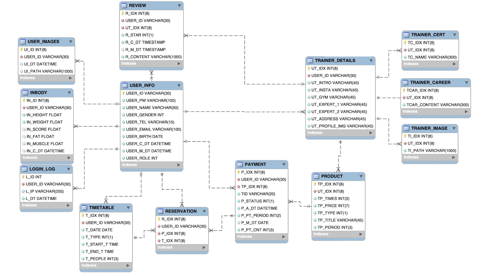
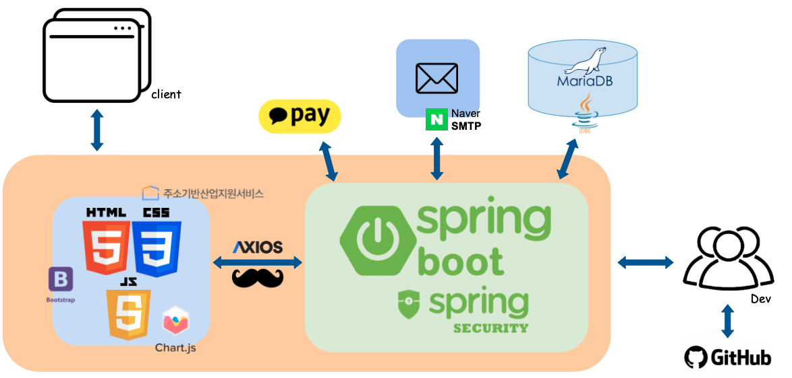

## 작심득근

### 프로젝트 소개

> ‘**작심 득근**’은 트레이너 별 카테고리를 통해 사용자가 PT 목적에 맞는 트레이너를 효율적으로 셀렉하고, PT 일정 관리를 한 페이지에서 함으로서 불필요하게 낭비되는 시간을 줄여주는 헬스 웹 서비스입니다.

 

### 주요기능

#### 📆 캘린더에서 자유롭게 PT 예약과 취소를 하고 일정을 한눈에 확인할 수 있어요!</h3>

  - PT 별 캘린더를 통해 사용자의 개인 일정에 맞춰 자유롭게 PT를 예약하고 취소할 수 있어요.
  - 일정을 월별, 일별로 볼 수 있고 남은 PT권 횟수 및 타입과 담당 트레이너의 간단한 정보까지 별도의 페이지 분리없이 한눈에 볼 수 있어 자주 사용되는 기능을 효율적으로 사용할 수 있습니다.
  - 사용자의 PT권 타입에 따라 참여 가능한 PT권만 조회되어 사용자가 시간을 혼동하지 않고 PT 예약을 할 수 있어요.

#### 🔍 자신에게 맞는 트레이너를 쉽게 찾을 수 있어요!</h3>

  - 헬스장 주소를 회사, 집 근처 등 원하는 곳으로 검색하여 맞는 트레이너를 검색할 수 있어요.
  - 전문분야 별 필터링을 통해 바디프로필, 재활운동 등 원하는 분야에 맞게 찾을 수 있어요.
  - 평점 별로 정렬이 되어 리뷰가 좋은 트레이너를 쉽게 선택할 수 있어요.

#### 📈 매일매일 변화하는 나의 모습, 인바디 페이지에서 확인하실 수 있어요!</h3>

  - 인바디 검사 결과를 기록하고 변해가는 나의 모습을 그래프로 볼 수 있어요!
  - 키와 몸무게만 기록해도 충분! 인바디 측정한 날엔 점수와 체지방, 근육량까지 입력할 수 있어요
  - 잘못 적은 내 정보는 삭제하고 다시 입력할 수 있어요.

### 상세 페이지

### 멤버 구성

<table>
    <tr>
        <th>구성 인원</th>
        <th>역할</th>
        <th>git</th>
    </tr>
    <tr>
        <td>구세은</td>
        <td>- 트레이너 관리 - 리뷰 관리 - 트레이너 PT 시간표 관리 - 트레이너 PT 이용자 조회</td>
        <td width="160px"></td>
    </tr>
    <tr>
        <td>남유정</td>
        <td>- PT 예약 관리 - PT권 관리 - 결제 - 캘린더 - 트레이너 시간표</td>
        <td width="160px"></td>
    </tr>
    <tr>
        <td>장효림</td>
        <td>- 회원가입 - 로그인 - 마이페이지 - 인바디</td>
        <td width="160px"></td>
    </tr>
</table>

### 기술 스택
 
- Springboot: 2.7.11
- Spring framework: 5.3.27
- Java: 11.0.18
- DB: MariaDB 11.0.2
- Server: Tomcat 9.0.74

### 아키텍처

#### ERD

#### 프로젝트 구조

#### 시퀀스 다이어그램
[시퀀스 다이어그램](./docs/sequence.md)

*** 작심득근 is available under the MIT license. ***