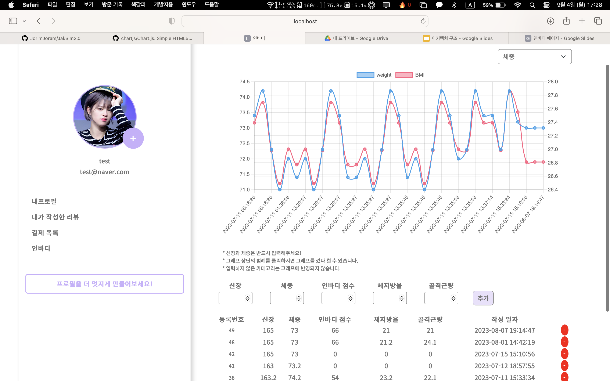

# 프로젝트 명
작심득근

# 프로젝트 소개

‘**작심 득근**’은 트레이너 별 카테고리를 통해 사용자가 PT 목적에 맞는 트레이너를 효율적으로 셀렉하고, PT 일정 관리를 한 페이지에서 함으로서 불필요하게 낭비되는 시간을 줄여주는 헬스 웹 서비스입니다.

# 프로젝트 차별성

**PT 이용자**

- 트레이너 별 카테고리를 통해 PT 목적에 맞는 트레이너를 보다 **효율적**으로 **찾을** 수 있게 합니다.
- PT 일정 관리를 캘린더 페이지에서 **PT 일정 관리를 효율적으로** 할 수 있게 합니다.

**트레이너**

- 확실한 본인 PR을 통해 보다 **높은 매칭률**이 나타나도록 합니다.
- 실제 PT 이용자를 기준으로 작성된 **정확한 평점**을 받도록 합니다.

# 주요기능

<h3> 📆 캘린더에서 자유롭게 PT 예약과 취소를 하고 일정을 한눈에 확인할 수 있어요!</h3>

  - PT 별 캘린더를 통해 사용자의 개인 일정에 맞춰 자유롭게 PT를 예약하고 취소할 수 있어요.
  - 일정을 월별, 일별로 볼 수 있고 남은 PT권 횟수 및 타입과 담당 트레이너의 간단한 정보까지 별도의 페이지 분리없이 한눈에 볼 수 있어 자주 사용되는 기능을 효율적으로 사용할 수 있습니다.
  - 사용자의 PT권 타입에 따라 참여 가능한 PT권만 조회되어 사용자가 시간을 혼동하지 않고 PT 예약을 할 수 있어요.

<h3> 🔍 자신에게 맞는 트레이너를 쉽게 찾을 수 있어요!</h3>

  - 헬스장 주소를 회사, 집 근처 등 원하는 곳으로 검색하여 맞는 트레이너를 검색할 수 있어요.
  - 전문분야 별 필터링을 통해 바디프로필, 재활운동 등 원하는 분야에 맞게 찾을 수 있어요.
  - 평점 별로 정렬이 되어 리뷰가 좋은 트레이너를 쉽게 선택할 수 있어요.

<h3> 📈 매일매일 변화하는 나의 모습, 인바디 페이지에서 확인하실 수 있어요!</h3>

  - PT가 끝나고 인바디 검사 결과를 기록하고 조금씩 변해가는 나의 모습을 그래프로 볼 수 있어요!
  - 키와 몸무게만 기록해도 충분! 인바디 측정한 날에는 다음에는 점수와 체지방, 근육량까지 입력해주세요. 변하는 내 모습을 더 확실하게 볼 수 있어요!
  - 잘못 적은 내 정보는 바로바로 삭제하고 다시 입력할 수 있어요.

# 상세 페이지

# 멤버 구성

| 구성 인원 | 역할                                                           | git profile                             |
|-----------|--------------------------------------------------------------|-----------------------------------------|
| 구세은   | - 트레이너 관리 - 리뷰 관리 - 트레이너 PT 시간표 관리 - 트레이너 PT 이용자 조회 |                                         |
| 남유정   | - PT 예약 관리 - PT권 관리 - 결제 - 캘린더 - 트레이너 시간표        | [git페이지](https://github.com/uzhjd)      |
| 장효림   | - 회원가입 - 로그인 - 마이페이지 - 인바디                          | [git페이지](https://github.com/JorimJoram) |

# 기술 스택
 
- Springboot: 2.7.11
- Spring framework: 5.3.27
- Java: 11.0.18
- DB: MariaDB 11.0.2
- Server: Tomcat 9.0.74

# 아키텍처

### ERD

### 프로젝트 구조

### 시퀀스 다이어그램

*** 작심득근 is available under the MIT license. ***
